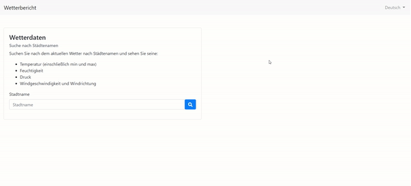

<h1 align="center">
   
  
   
</h1>

<h4 align="center">
    A django project to return the current weather forecast in cities
</h4>

  <a href="#key-features">Key Features</a> •
  <a href="#docker-set-up">Docker Set Up</a>

---

## Key Features

### City Search
The main purpose of the weather report app is the city search with uses the <a href="https://openweathermap.org/api">OpenWeather API</a>. This will return the current weather forecast in a city found using this API. 

### Languages
The weather report app currently supports 3 languages:
- English
- German
- French

You can select and update the language in the top nav bar. 

---

## Docker Set Up

In the root of the repository:
- Copy and paste `django.local.env` and rename to `django.env`
- <b>Create a free openweather account at https://openweathermap.org/ and update OPEN_WEATHER_API_KEY to your api key</b> 
- In the command line run 

`docker-compose up --build -d`

- When all of your containers have successfully been built, navigate to http://localhost:8000/ and enjoy :tada:
